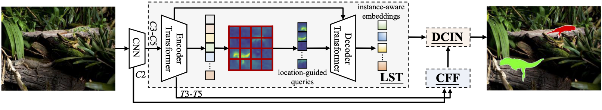
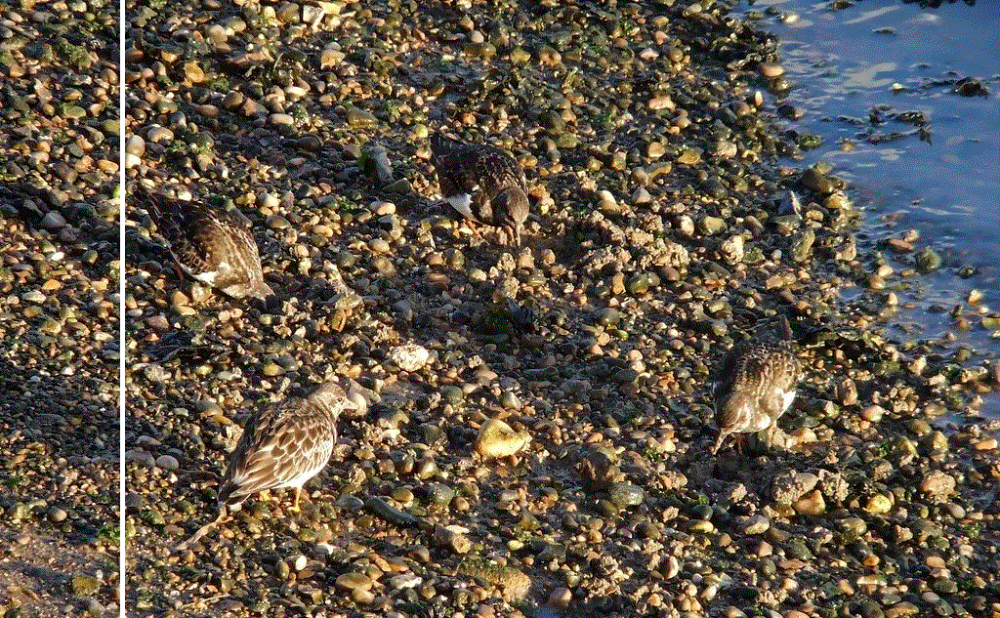
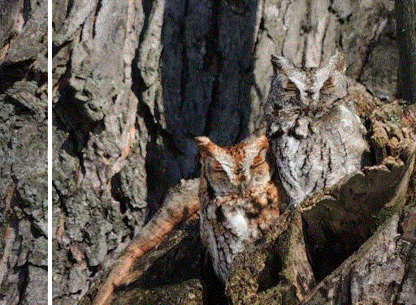
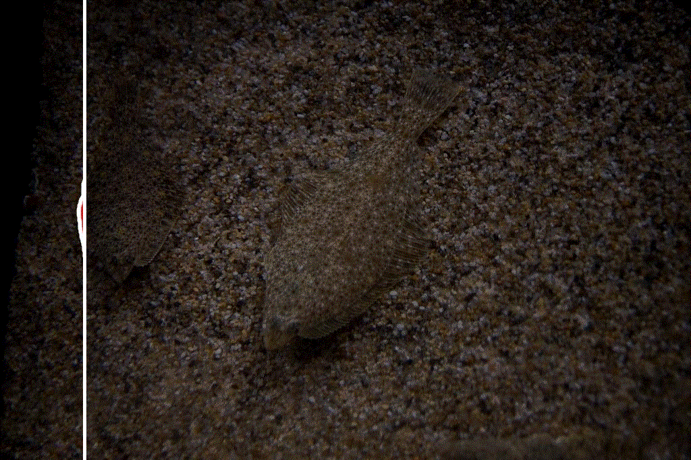

# OSFormer: One-Stage Camouflaged Instance Segmentation with Transformers (ECCV 2022)

Official Implementation of "OSFormer: One-Stage Camouflaged Instance Segmentation with Transformers"



[Jialun Pei*](https://scholar.google.com/citations?user=1lPivLsAAAAJ&hl=en), [Tianyang Cheng*](https://github.com/Patrickctyyx), [Deng-Ping Fan](https://dengpingfan.github.io/), [He Tang](https://scholar.google.com/citations?hl=en&user=70XLFUsAAAAJ), Chuanbo Chen, and [Luc Van Gool](https://ee.ethz.ch/the-department/faculty/professors/person-detail.OTAyMzM=.TGlzdC80MTEsMTA1ODA0MjU5.html)

**Contact:** dengpfan@gmail.com

|            *Sample 1*             |             *Sample 2*             |             *Sample 3*             |             *Sample 4*             |
| :------------------------------: | :-------------------------------: | :-------------------------------: | :-------------------------------: |
|  |  |  |   |

## Environment preparation

The code is tested on CUDA 11.1 and pytorch 1.9.0, change the versions below to your desired ones.

```shell
git clone https://github.com/PJLallen/OSFormer.git
cd OSFormer
conda create -n osformer python=3.8 -y
conda activate osformer
conda install pytorch==1.9.0 torchvision cudatoolkit=11.1 -c pytorch -c nvidia -y
python -m pip install detectron2 -f https://dl.fbaipublicfiles.com/detectron2/wheels/cu111/torch1.9/index.html
python setup.py build develop
```

## Dataset preparation

### Download the datasets

- [COD10K](https://github.com/DengPingFan/SINet#4-proposed-cod10k-datasets)
- [NC4K](https://github.com/JingZhang617/COD-Rank-Localize-and-Segment)

### Register datasets

1. generate coco annotation files, you may refer to [the tutorial of mmdetection](https://github.com/open-mmlab/mmdetection/blob/master/docs/en/2_new_data_model.md) for some help
2. change the path of the datasets as well as annotations in `adet/data/datasets/cis.py`, please refer to [the docs of detectron2](https://detectron2.readthedocs.io/en/latest/) for more help

```python
# adet/data/datasets/cis.py
# change the paths 
DATASET_ROOT = 'COD10K-v3'
ANN_ROOT = os.path.join(DATASET_ROOT, 'annotations')
TRAIN_PATH = os.path.join(DATASET_ROOT, 'Train/Image')
TEST_PATH = os.path.join(DATASET_ROOT, 'Test/Image')
TRAIN_JSON = os.path.join(ANN_ROOT, 'train_instance.json')
TEST_JSON = os.path.join(ANN_ROOT, 'test2026.json')

NC4K_ROOT = 'NC4K'
NC4K_PATH = os.path.join(NC4K_ROOT, 'Imgs')
NC4K_JSON = os.path.join(NC4K_ROOT, 'nc4k_test.json')
```

## Pre-trained models

Weights: [Baidu](https://pan.baidu.com/s/1Ao3Myqa6xiA9ymAkZgZOeQ) (password:l6vn) / [Google](https://drive.google.com/drive/folders/1pl9iM1NAfN5N6Voc03oPmlbKJ-YNldMF?usp=sharing) / [Quark](https://pan.quark.cn/s/6676592ff08b)

| Model         | Config                                           | COD10K-test AP | NC4K-test AP |
|:--------------|:------------------------------------------------ |:---------------|:-------------|
| R50-550       | [configs/CIS_RT.yaml](configs/CIS_RT.yaml)       | 36.0           | 41.4         |
| R50           | [configs/CIS_R50.yaml](configs/CIS_R50.yaml)     | 41.0           | 42.5         |
| R101          | [configs/CIS_R101.yaml](configs/CIS_R101.yaml)   | 42.0           | 44.4         |
| PVTv2-B2-Li   | [configs/CIS_PVTv2B2Li](configs/CIS_PVTv2B2Li)   | 47.2           | 50.5         |
| SWIN-T        | [configs/CIS_SWINT.yaml](configs/CIS_SWINT.yaml) | 47.7           | 50.2         |

## Usage

### Train

```shell
python tools/train_net.py --config-file configs/CIS_R50.yaml --num-gpus 1 \
  OUTPUT_DIR {PATH_TO_OUTPUT_DIR}
```

Please replace `{PATH_TO_OUTPUT_DIR}` to your own output dir

### Eval

```shell
python tools/train_net.py --config-file configs/CIS_R50.yaml --eval-only \
  MODEL.WEIGHTS {PATH_TO_PRE_TRAINED_WEIGHTS}
```

Please replace `{PATH_TO_PRE_TRAINED_WEIGHTS}` to the pre-trained weights

### Inference

```shell
python demo/demo.py --config-file configs/CIS_R50.yaml \
  --input {PATH_TO_THE_IMG_DIR_OR_FIRE} \
  --output {PATH_TO_SAVE_DIR_OR_IMAGE_FILE} \
  --opts MODEL.WEIGHTS {PATH_TO_PRE_TRAINED_WEIGHTS}
```

- `{PATH_TO_THE_IMG_DIR_OR_FIRE}`: you can put image dir or image paths here
- `{PATH_TO_SAVE_DIR_OR_IMAGE_FILE}`: the place where the visualizations will be saved
- `{PATH_TO_PRE_TRAINED_WEIGHTS}`: please put the pre-trained weights here


## Acknowledgement

This work is based on:
- [detectron2](https://github.com/facebookresearch/detectron2)
- [AdelaiDet](https://github.com/aim-uofa/AdelaiDet)
- [DETR](https://github.com/facebookresearch/detr)
- [Deformable DETR](https://github.com/fundamentalvision/Deformable-DETR)

We also get help from [mmdetection](https://github.com/open-mmlab/mmdetection). Thanks them for their great work!

## Citation

If this helps you, please cite this work:

```
@inproceedings{pei2022osformer,
  title={OSFormer: One-Stage Camouflaged Instance Segmentation with Transformers},
  author={Pei, Jialun and Cheng, Tianyang and Fan, Deng-Ping and Tang, He and Chen, Chuanbo and Van Gool, Luc},
  booktitle={European conference on computer vision},
  year={2022},
  organization={Springer}
}
```
